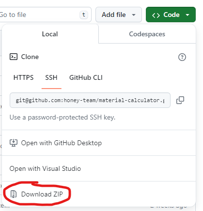
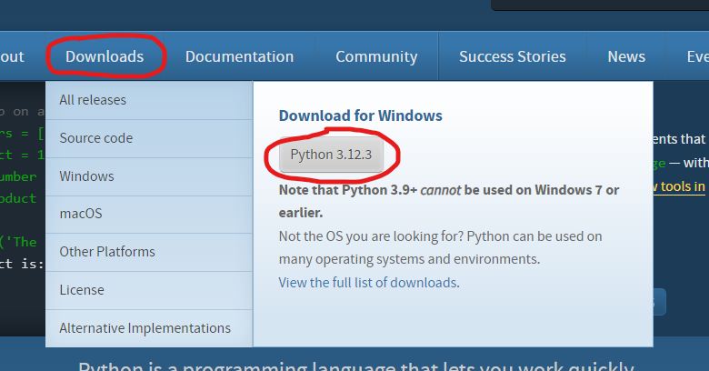

# Material calculator
Material calculator for Windows using Flet

## Installing

### 1. Download ZIP file with all folders and files on GitHub site


Just click "Download ZIP" button in "Code" tab

### 2. Install Python if he isn't installed on your Desktop (if you have 3.11 and lower, install 3.12 (recomended))
1. Go to [official python site](https://python.org)
2. Hover "Download" button
3. Click "Python 3.12.3" button (may other version)

4. Run downloaded exe and follow instructions

### 3. Unpack downloaded ZIP and run "main.py" file

Just use this command (in unpacked dir)

```
python main.py
# or
py main.py
```

If you have 2 or more Python versions, use this command

```
python -3.12 main.py
# or
py -3.12 main.py
```

### 4. Use calculator and enjoy!

